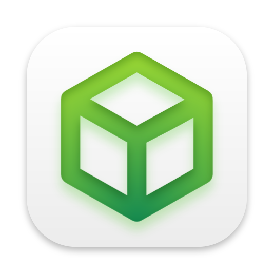

<p align="center">
    
    <h1 align="center">ManyMC</h1>
    <p align="center">
        A familiar Minecraft Launcher with native support for macOS arm64 (M1)
    </p>
</p>

---

> ### ⚠️ ManyMC is an official project of the PolyMC organization. Despite this, please only report issues with ManyMC here.

---

## Supported versions

All stable versions of Minecraft from `1.6.4` to the latest have been tested and work great. [Fabric](https://fabricmc.net), [Forge](https://forums.minecraftforge.net), and [OptiFine](https://optifine.net/home) also work across all versions. Even huge modpacks like [All the Mods 6](https://www.curseforge.com/minecraft/modpacks/all-the-mods-6) run perfectly!

## Community

You are welcome to join the official Discord where you can get faster support and discuss the future of ManyMC. Link is here: https://discord.gg/CcFxPaDnjv

## More fixes

Can't sprint and attack at the same time? Or sneak and scroll? These are all old and unfixed Minecraft bugs on macOS. Get rid of them now using our mod [McMouser](https://github.com/MinecraftMachina/McMouser) ([CurseForge](https://www.curseforge.com/minecraft/mc-mods/mcmouser)).

## Install

~~There are two ways to install ManyMC, please choose one~~ Since brew removed the different versions of the Azul OpenJDK, only one way of installing is currently supported : the manual way.

### Manual

1. Install the Azul OpenJDK 17 and Azul OpenJDK 8 in arm64 versions with these links. These are versions of Java made for the processor type of the Mx Macs :
- [Azul OpenJDK 17 arm64](https://www.azul.com/downloads/?version=java-17-lts&os=macos&architecture=arm-64-bit&package=jdk)
- [Azul OpenJDK 8 arm64](https://www.azul.com/downloads/?version=java-8-lts&os=macos&architecture=arm-64-bit&package=jdk)

2. Download the [latest release](https://github.com/MinecraftMachina/ManyMC/releases/latest/download/ManyMC.zip) of ManyMC and extract it. You can move the app to your "Applications" folder if you like.
3. Start ManyMC. If it gives an error about "developer cannot be verified", one time only, do not double-click on the app, but instead right-click on it and press `Open`, then `Open` again.

4. As you go through the initial setup, make sure to select the correct `arm64` native Java for the version of Minecraft you want to play. Depending on which version of Minecraft you want to play, you will need to use a different version of Java. Use the table below to find the correct Java path for your Minecraft version, and select it when ManyMC prompts you:

   | Minecraft Version  | Java Version | Architecture | Path                                                                 |
   | ------------------ | ------------ | ------------ | -------------------------------------------------------------------- |
   | 1.16 and below     | 1.8.0_X      | aarch64      | /Library/Java/JavaVirtualMachines/zulu-8.jdk/Contents/Home/bin/java  |
   | 1.17 and above     | 17.X.X       | aarch64      | /Library/Java/JavaVirtualMachines/zulu-17.jdk/Contents/Home/bin/java |
   
   > :information_source: NOTE: You can always change the Java version individually by selecting a Minecraft instance and clicking on `Edit instance > Settings > Java installation`.

5. To update ManyMC in the future, simply delete the app and replace it with the new version from this GitHub page. Your data will not be affected.

If you had trouble with this guide, check the following [unofficial video tutorial](https://www.youtube.com/watch?v=At5nF5i8oTg) or reach out on Discord for help.

## Troubleshooting

- Minecraft/MultiMC released an update, but I can't see it in ManyMC
  - Changes are pulled approximately every 2 hours. If after that long the update is still missing, raise an issue.
- OptiFine doesn't work
  - To fix, install one of the two combinations below:
    - Forge + OptiFine
    - Fabric + [OptiFabric](https://www.curseforge.com/minecraft/mc-mods/optifabric) + OptiFine
  - Use the latest **preview** version of OptiFine
- Minecraft `1.16 and before` crash on boot
  - Make sure you have installed and selected Java 8 in ManyMC, not a newer version. Read the installation section for more information.
- Forge/modpack for Minecraft `1.16 and before` crashes on boot
  - Either update Forge to the latest version, or downgrade Java to build 320 or before
- Minecraft `1.5.2 and before` has inverted colors and stuttering
  - On Minecraft 1.4.7-1.5.2, enable Fullscreen mode from the game's `Options` > `Video Settings`.
  - On older versions, press F11 to enable fullscreen.
    - You may have to press Fn+F11 or rebind your Show Desktop keybind in `System Preferences` > `Mission Control` > `Show Desktop` for F11 to be sent to Minecraft

## How does it work

Minecraft is mostly written in Java, which means that as long as you have a native arm64 Java installed, you can almost run the game natively. The only exception are some libraries like LWJGL, which have platform-specific binaries. Fortunately, all of them are open-source, so they can be re-built to work.

This launcher is a fork of [PolyMC](https://github.com/PolyMC/PolyMC), since the latter does not yet natively support arm64. To comply with PolyMC's licensing, this launcher was rebranded to ManyMC. To use the custom native libraries, a dedicated [meta package](https://github.com/MinecraftMachina/meta-multimc-arm64/) has been created.

## Building

> ⚠️ This will only work on macOS. Tested on macOS 12.1 arm64.

1. Install dependencies:

   ```bash
   brew tap homebrew/cask-versions
   brew install zulu8 qt@5 cmake
   ```

2. Install XCode and make sure the command line tools are set up:

   ```bash
   xcode-select -p
   ```

3. Run a build:

   ```bash
   ./build.sh
   ```

   - You will need your own secrets if you want login with Microsoft account to work. Copy [notsecrets](notsecrets) to a new directory called `secrets` and follow the README inside.
   - If you get weird Java errors, you may have to manually set your `JAVA_HOME` to the zulu8 you just installed.
